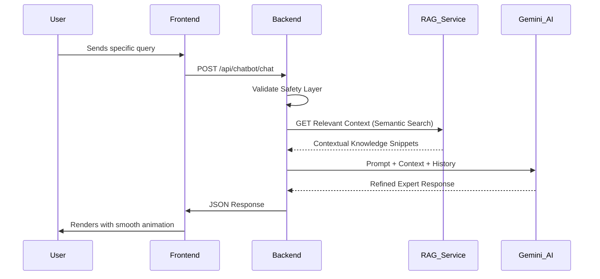

# 🌐 MindSettler Technical Architecture Overview

Welcome to the core technical documentation for MindSettler. This document outlines the high-level architecture and the flow of information across our multi-tier system.

## 🏛️ System Architecture

MindSettler is built on a modern, decoupled architecture designed for high responsiveness, emotional safety, and intelligent content delivery.

### Core Components

1.  **Frontend (React & Vite)**:
    - **Aesthetic**: Premium, editorial design with GSAP and Framer Motion.
    - **Logic**: State management via Zustand and React Query for API synchronization.
    - **Admin Panel**: A centralized dashboard for content management and "Brain Feeding" (RAG ingestion).

2.  **Backend (Node.js & Express)**:
    - **API Gateway**: Handles authentication, booking flows, and content delivery.
    - **Safety Layer**: A critical middleware that sanitizes user input and ensures AI responses remain safe and supportive.
    - **Database**: MongoDB for user data, sessions, and transaction history.

3.  **External RAG Microservice (Python & FastAPI)**:
    - **Intelligence**: An isolated service dedicated to Retrieval-Augmented Generation.
    - **Vector Storage**: Uses ChromaDB for high-dimensional semantic search.
    - **Processing**: Python-based ingestion pipeline for .md and .txt knowledge files.

---

## 🎯 Business & Social Intent

MindSettler isn't just a web app; it's a **Digital Sanctuary** designed to solve the accessibility gap in mental health care.

### The Business Moat: "Institutional Memory"
Our RAG-based architecture creates a proprietary **Institutional Memory**. By feeding the RAG system clinical papers, founder insights, and vetted policies, we ensure the platform's "IQ" grows daily without increased human overhead. This is a highly scalable business model where the cost of intelligence decreases as the knowledge base grows.

### Social Impact: Demystifying Therapy
By using **Psycho-education** as the entry point, we lower the "stigma barrier." Users interact with high-end visuals and an empathetic AI assistant, making the transition to human-led therapy feel natural rather than clinical or scary. We are essentially building a "Bridge to Care."

---

## 🔄 High-Level Workflow

The following diagram represents the end-to-end flow of a user interaction with the intelligent assistant.

---

## 🚀 Key Technical Features

- **Decoupled RAG**: The intelligence layer is separated from the business logic, allowing independent scaling of the AI components.
- **GSAP ScrollTrigger**: Powering the immersive storytelling experience on the Psycho-education Hub.
- **Glassmorphism UI**: A consistent design language across all components (Modals, Cards, Hero sections).
- **Multi-key LLM Rotation**: Backend service that manages API rate limits by rotating Gemini keys dynamically.

---

> [!IMPORTANT]
> This documentation is a living document. For detailed implementation details of specific modules, please refer to the sub-documents in this folder.
