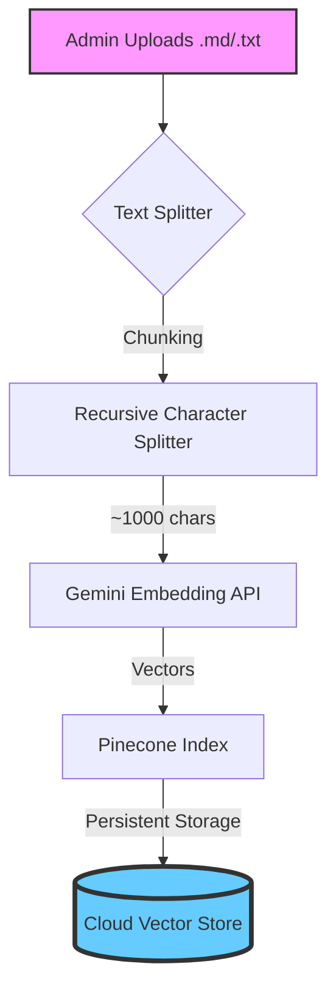
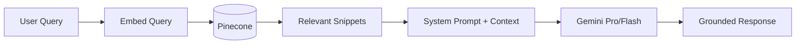

# 🧠 Internal RAG Microservice Architecture

The Retrieval-Augmented Generation (RAG) system is the "Brain" of MindSettler. It allows our chatbot to provide grounded, factual information based on our proprietary knowledge base rather than relying solely on the LLM's pre-trained data.

## 🏗️ Technical Stack

- **Language**: Python 3.9+
- **Framework**: Flask (Web Framework)
- **Vector DB**: **Pinecone** (Cloud-native vector database)
- **Embeddings**: Google Gemini Embedding API
- **Document Processing**: LangChain / Custom Markdown Parsers

---

## 📥 Ingestion Workflow (Feeding the Brain)

When an admin uploads a document via the "Feed Brain" interface, the following technical process occurs:

### Key Technical Details:
- **Chunking Strategy**: We use a `RecursiveCharacterTextSplitter` with an overlap (e.g., 100-200 chars) to ensure context isn't lost at the boundaries of chunks.
- **Persistence**: Pinecone handles infrastructure and persistence in the cloud, ensuring high availability and global scalability.

---

## 🔍 Retrieval & Generation Flow

When a user asks a question, the system performs a semantic search to find the most relevant "memory".

### Advantages of this Microservice Approach:

| Feature | Dynamic RAG | Standard LLM |
| :--- | :--- | :--- |
| **Accuracy** | High (uses verified docs) | Medium (prone to hallucination) |
| **Up-to-date** | Instant (via Feed Brain) | Static (until next model train) |
| **Domain Specific** | Expert in MindSettler | General Knowledge |
| **Data Privacy** | Sensitive data stays in RAG | Shared with Model Provider |

---

## 🛠️ API Interface (External to Backend)

The microservice exposes the following core endpoints:

- `POST /admin/ingest`: Accepts a file or raw text to add to the knowledge index.
- `POST /query`: Performance semantic similarity search and returns the top-K relevant chunks.
- `GET /health`: Monitors the status of the vector DB and embedding engine.

---

> [!TIP]
> **Semantic Search** works by comparing the "Cosine Similarity" between the vector representation of the user's question and the stored document vectors. This is far more powerful than simple keyword matching.
