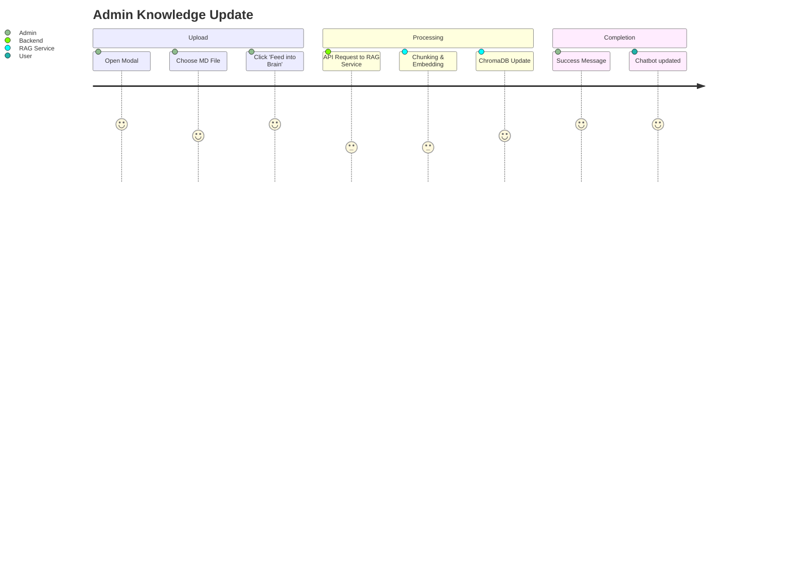

# 🛠️ Admin Intelligence & System Management

The MindSettler Admin Panel is the control center for both content delivery and the intelligence engine. It is designed to empower non-technical administrators to maintain a high-quality knowledge base.

## 🧠 The "Feed Brain" Feature

The most impactful feature of the admin panel is the RAG Ingestion Interface.

### Workflow:
1.  **Selection**: Admin identifies a new policy, article, or session guide.
2.  **Ingestion**: Using the `RAGUploadModal`, the document is sent to the External RAG Microservice.
3.  **Vectorization**: The microservice processes the text into vector embeddings.
4.  **Deployment**: The chatbot instantly gains access to this new information.

---

## 📈 Impact & Advantages

- **Zero-Downtime Updates**: The system's knowledge can be expanded without redeploying code or restarting servers.
- **Traceability**: Admins can see exactly how many chunks of data were indexed from each document.
- **Safety Overrides**: By controlling the source material (the "Brain's food"), admins ensure the AI never hallucinates incorrect policies or therapeutic approaches.

---

## 📋 Content Management

Beyond the AI, the admin panel manages:
- **Psycho-education Library**: CRUD operations for all clinical resources.
- **Media Management**: Uploading and categorizing video resources and worksheets.
- **Booking Dashboard**: Real-time view of user appointments and payment statuses.

---

> [!WARNING]
> **Data Integrity**: Admins should ensure that uploaded documents are in a clean Markdown (.md) or Text (.txt) format. Images or complex tables should be avoided as they may not be parsed correctly by the current RAG ingestion pipeline.
