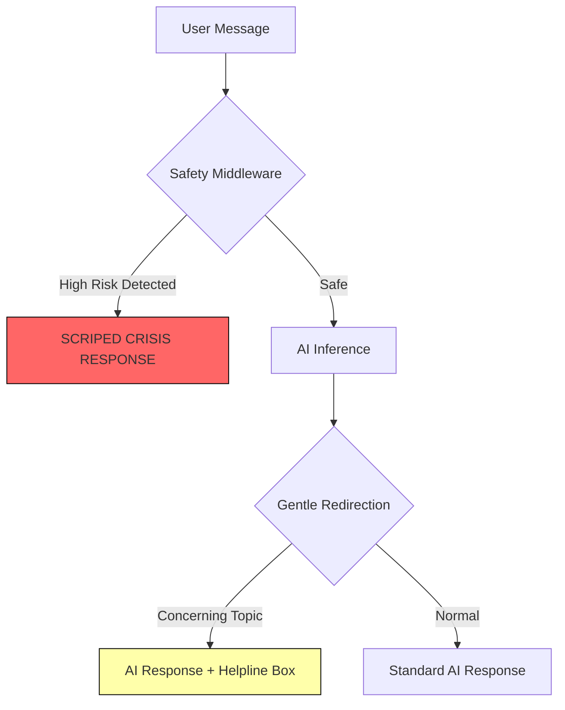

# 🛡️ Safety, Compliance, and Ethics

As a mental health platform, **Safety is our #1 technical priority**. We have implemented a multi-layered safety protocol that sits between the user and the AI.

## 🧱 The Safety Layer

Every message sent to the chatbot passes through a custom `safetyLayer.js` before reaching the LLM.

### 1. Keyword Detection (The Redline)
We maintain a dictionary of high-risk keywords related to self-harm, medical emergencies, or severe distress.

### 2. Immediate Crisis Response
If a "Redline" keyword is detected, the system **bypasses the AI entirely** and returns a pre-scripted, clinically-vetted crisis resources response.

---

## ⚖️ Ethical AI Boundaries

We adhere to the following strict boundaries for our AI systems:

- **No Diagnosis**: The AI is programmed to explicitly state it cannot diagnose mental health conditions.
- **No Treatment**: The AI guides users to resources and human-led booking, but never provides therapeutic "treatment" on its own.
- **Human-in-the-Loop**: The RAG knowledge base is human-curated. The AI only knows what we allow it to know.

---

## 🔒 Data Privacy

- **Encryption**: All user communications are encrypted in transit using SSL/TLS.
- **Minimal PII**: We minimize the storage of Personally Identifiable Information within our AI processing logs.
- **Optional Reflection**: Sensitive data gathering (like the Reflection Questionnaire) is strictly optional and only accessible to the assigned therapist.

---

> [!IMPORTANT]
> **Crisis Disclaimer**: The MindSettler Assistant is not a crisis intervention tool. In case of immediate danger, users are always directed to call **112** (Emergency services in India) or visit the nearest hospital.
