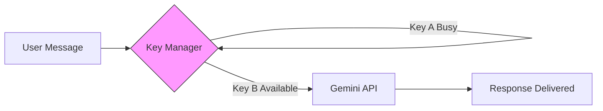

# 📈 Scalability, Cost-Efficiency, and Future Vision

For a professional mental health platform to survive and thrive, it must be both **technically resilient** and **cost-effective**. MindSettler implements several high-level strategies to ensure we can scale from 100 to 100,000 users without breaking the bank or the experience.

## 🔑 Multi-Key Rotation: Robustness for Free
One of our most impactful technical implementations is the **Multi-Key LLM Rotation Engine**.

### The Problem:
Proprietary AI APIs (like Gemini or OpenAI) have strict rate limits on free or lower-tier tiers. High traffic can lead to 429 Errors (Too Many Requests), breaking the user experience.

### Our Solution:
The backend intelligently monitors the health of a pool of API keys. When one key reaches its limit, the system **automatically rotates** to the next available key with Zero-Downtime.

- **Business Advantage**: High availability without upfront enterprise platform costs.
- **Technical Advantage**: Fail-safes against API outages.

---

## 🚀 Scalability of the RAG Index
As the knowledge base grows to thousands of documents, standard search fails. Our use of **Vector Embeddings** ensures that search time remains logarithmic rather than linear.
- **Modular Microservice**: The RAG engine can be deployed on specialized "AI-compute" instances while the main backend stays on lightweight web servers.

---

## 🔮 Future Roadmap: The "Intelligent Journey"

The architecture is built to support the following upcoming features:

### 1. Mood Analytics Dashboard
Using the data gathered from the **Reflection Questionnaire**, we can generate anonymized trend reports for corporate clients, showing the "Emotional Health Index" of their workforce.

### 2. Multi-Modal Memory
The next phase of RAG will include **Audio/Video Ingestion**. Admins could feed a recording of a seminar into the "Brain", and the chatbot could answer questions about that specific talk instantly.

### 3. Therapy Matching Algorithm
A data-driven approach to match users with the specific therapist best suited for their profile, based on historical success rates and clinical specialties.

---

> [!IMPORTANT]
> **Social Responsibility**: As we scale, we maintain our "Human-in-the-Loop" philosophy. Technology serves to connect a human seeker to a human healer—not to replace them.
