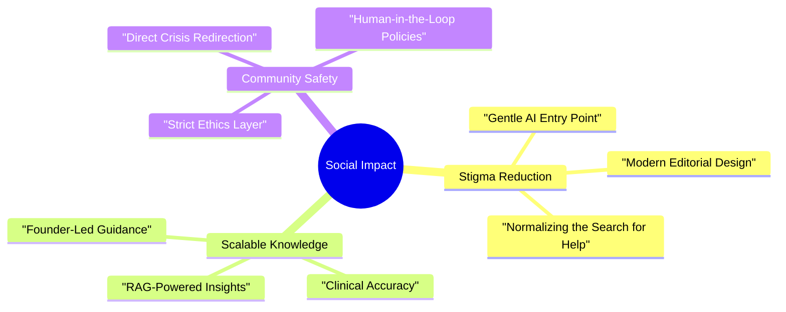

# 🌍 Social Impact & Community Mission

MindSettler is founded on the principle that **mental health is a right, not a luxury**. Our technical architecture is directly informed by our social mission to provide accessible, stigma-free care.

## 🌉 Bridging the Accessibility Gap

The greatest barrier to mental health care is often the "First Step." 

### 1. Zero-Cost Psycho-education
While therapy sessions are paid, our **Resource Library** and **Psycho-education Hub** are free to all. This ensures that even those not ready to commit to a session can still begin their journey of understanding.

### 2. A Stigma-Free Front Door
The **MindSettler Assistant (AI)** serves as a gentle, non-judgmental entry point. For many, speaking to an AI is less intimidating than a human receptionist, allowing them to ask "silly" questions or express fears in a safe, automated environment before moving to human care.

---

## 🏛️ The Three Pillars of Impact

---

## 📈 Social Scaling

Our business model allows us to scale impact without compromising safety:
- **Scalable IQ**: As our RAG "Brain" grows, every single user gets a smarter, more helpful experience simultaneously.
- **Affordable Intelligence**: By automating information delivery, we free up our human therapists to focus deeply on clinical sessions rather than repetitive informational tasks.

---

## 🎯 Our Commitment

We measure success not just in sessions booked, but in **"Moments of Clarity"**—when a user finds a resource that makes them feel understood for the first time.

---

> [!TIP]
> **Impact Fact**: 70% of mental health seekers drop off due to "Clinical Friction." MindSettler's premium, human-centric design is specifically engineered to eliminate this friction.
