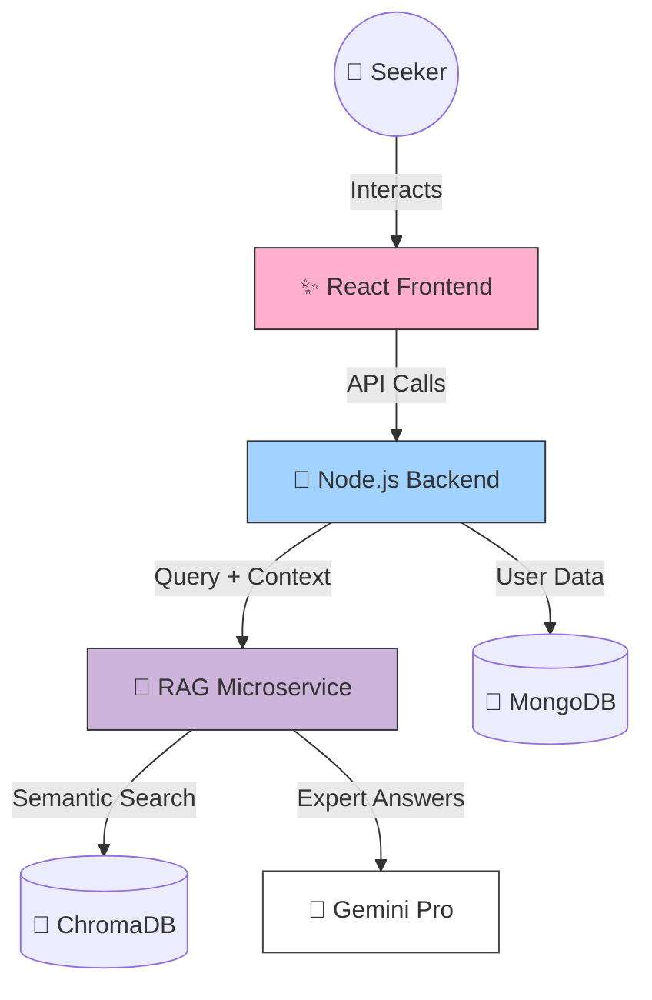

<div align="center">

# 🧠 MindSettler
### *Understand the Why before the How.*

[](https://reactjs.org/)
[](https://nodejs.org/)
[](https://www.mongodb.com/)
[](https://fastapi.tiangolo.com/)

**The ultimate digital sanctuary designed for the modern mind.**  
Built with ✨ aesthetic vibes ✨ and heavy-duty intelligence.

[🌐 Explore the Sanctuary](https://gwoc-lovat.vercel.app) • [🧠 Access the AI Brain](https://gwoc-t7pn.onrender.com)

</div>

---

## 🌈 What is MindSettler?

MindSettler isn't just an app; it's a mood. We've combined **premium motion design** with **Retrieval-Augmented Generation (RAG)** to create a mental health ecosystem that actually "gets" you. No boring clinical forms, just pure, human-led clarity.

## ✅ Vibe Check (What We Provide)
- **🧠 24/7 AI Sanctuary**: Real-time support grounded in clinical knowledge.
- **📚 Knowledge Library**: High-end visuals and articles to help you understand your brain.
- **❤️ Human-Led Clarity**: The perfect bridge between curiosity and actual therapy.
- **🔒 Safe Harbor**: Your data is yours. Period.

---

## 🛠️ The Receipts (Tech Stack)

<div align="left">
  
</div>

<br />

| Layer | Tools | Status |
| :--- | :--- | :--- |
| **Frontend** | React, GSAP, Framer Motion | ✨ Cinematic |
| **Backend** | Node.js, Express, MongoDB | 🚀 High-speed |
| **AI Brain** | FastAPI, ChromaDB, Gemini | 🧠 Genius |

---

## 🏛️ System Architecture

Our tech is decoupled, which means our AI can think while our Frontend dances.



---

## 📈 Social Impact

We're out here breaking the stigma. By providing a **stigma-free front door** (our AI) and a **zero-cost resource library**, we're making sure mental wellness isn't behind a paywall. 

---

## 🛠️ Dev Setup in 30 Seconds

```bash
# Clone the vibe
git clone https://github.com/Siddh-2006/GWOC.git

# Feed the backend
cd backend && npm install && npm run dev

# Light up the frontend
cd ../frontend && npm install && npm run dev
```

---

## 💖 Created with Love
**Created with ❤️ by Team BrightWeb**

Proudly built for **GWOC**. We're a team of dreamers, builders, and mental health advocates.

**Connect with us:**
- **Founder & Lead**: [Parnika](https://github.com/Siddh-2006)
- **Project Lead**: [Siddh](https://github.com/Siddh-2006)
- **The Team**: [Team BrightWeb]

---

<div align="center">
  
  
  <br />
  <sub>© 2026 MindSettler | Team BrightWeb. Build for the curious mind.</sub>
</div>