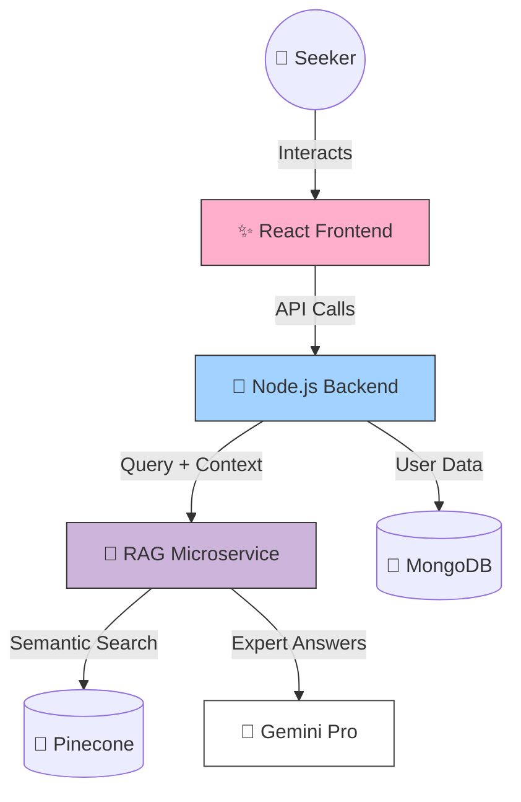

<div align="center">

# 🧠 MindSettler
### *The Ultimate Digital Sanctuary for Mental Well-being.*

[](https://reactjs.org/)
[](https://nodejs.org/)
[](https://www.mongodb.com/)
[](https://fastapi.tiangolo.com/)
[](https://opensource.org/licenses/MIT)

**Breaking the clinical friction between seekers and support.**  
Built for the curious, the brave, and the modern mind.

[🌐 Explore the Sanctuary](https://gwoc-lovat.vercel.app) • [🧠 Access the AI Brain](https://gwoc-t7pn.onrender.com) • [📔 Read the Technical Docs](Docs/00_Index.md)

</div>

---

## 🌈 The Vision

MindSettler is a premium, RAG-powered mental health ecosystem designed to bridge the gap between human empathy and technological innovation. We believe that mental health resources should be as immersive as a high-end magazine and as intelligent as a clinical expert.

---

## 🚀 The Core Ecosystem

### 🧠 1. The Intelligence Layer (RAG & AI)
Our proprietary **Retrieval-Augmented Generation (RAG)** system ensures that our AI doesn't just "chat"—it provides grounded, factual clinical insights based on our curated knowledge base.
- **Microservice Isolation**: Python/FastAPI service dedicated to high-dimensional semantic search.
- **Dynamic Brain Feeding**: Admins can upload `.md` or `.txt` files to instantly expand the "Brain's" knowledge.
- **Multi-Key Rotation**: Intelligent backend that rotates Gemini API keys to ensure zero-downtime availability.

### ✨ 2. The Immersive Frontend
Using **GSAP** and **Framer Motion**, we've crafted a "Digital Sanctuary" aesthetic.
- **Psycho-education Hub**: A scroll-driven storytelling experience that demystifies mental health struggles.
- **Glassmorphism UI**: Breathable, semi-transparent layers that provide depth without overwhelming the senses.
- **Interactive Pillars**: Real-time feedback and hover-dynamic cards for a premium discovery experience.

### 🛡️ 3. Safety & Crisis Middleware
Safety is baked into our code, not just an afterthought.
- **The Redline Protocol**: Custom middleware that monitors for high-risk keywords in real-time.
- **Immediate Redirection**: If a crisis is detected, the AI is bypassed, and validated crisis resources are displayed instantly.

---

## 🛠️ The Receipts (Tech Stack)

<div align="left">
  
</div>

<br />

| Layer | Technology | Role | Status |
| :--- | :--- | :--- | :--- |
| **Frontend** | React 18, Vite | UI Rendering & Component Lifecycle | ✨ Cinematic |
| **Motion** | GSAP, Framer Motion | ScrollTrigger & Micro-interactions | 🎬 Smooth |
| **Backend** | Node.js, Express | API Gateway & Safety Filtering | 🚀 High-speed |
| **Database** | MongoDB | Persistent User & Session Data | 🍃 Robust |
| **Intelligence** | Python, FastAPI | Vector Embedding & RAG Pipeline | 🧠 Genius |
| **Vector DB** | Pinecone | Cloud-native Vector Search | 📂 Scalable |

---

## 🏛️ System Architecture

Our tech is decoupled, which means our AI can think while our Frontend dances.



---

## ✅ The User Journey (How It Works)

1.  **Awaken**: The user arrives at a premium, calming interface.
2.  **Explore**: They navigate the Psycho-education library, learning through immersive visuals.
3.  **Reflect**: A private, optional Reflection Questionnaire helps them articulate their inner state.
4.  **Connect**: The user interacts with the RAG-powered assistant to clarify their needs.
5.  **Heal**: A seamless booking flow connects them with a human therapist for deep clinical care.

---

## 📈 Social & Business Impact

- **Stigma Reduction**: By using high-end "Gen Z" aesthetics, we make mental health feel like a lifestyle choice rather than a medical chore.
- **Scalable IQ**: Our "Institutional Memory" moat grows every time an admin feeds the brain.
- **Efficiency**: Automating informational queries frees up human therapists to focus 100% on clinical sessions.

---

## 🛠️ Development Setup

```bash
# Clone the Sanctuary
git clone https://github.com/Siddh-2006/GWOC.git

# Ignite the Backend
cd backend && npm install && npm run dev

# Launch the Intelligence (Optional for Local)
cd ../Chatbot && pip install -r requirements.txt && python app.py

# Light up the Frontend
cd ../frontend && npm install && npm run dev
```

---

## 💖 Created with Love
**Created with ❤️ by Team BrightWeb**

Proudly built for **GWOC**. We're a team of dreamers, builders, and mental health advocates.

**Connect with the Architects:**
- **Founder & Lead Developer**: [Parnika](https://github.com/Siddh-2006)
- **Project Lead & Visionary**: [Siddh](https://github.com/Siddh-2006)
- **Technical Excellence**: [Team BrightWeb]

---

<div align="center">
  
  
  <br />
  <sub>©2026 MindSettler | Team BrightWeb. Build for the curious mind.</sub>
</div>